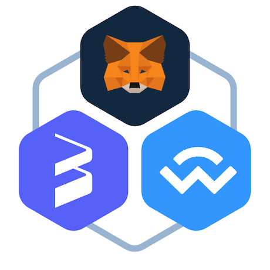

# react-web3-wallet

<p align="center">
  <a href="https://app.voltz.xyz/">
    <picture>
      
    </picture>
  </a>
</p>

<p align="center">Powering Voltz UI and beyond!!!</p>

<p align="center">
  
  
  
</p>

<p align="center">
Library that takes care of connecting to different web3 wallets.
</p>

<br />

| Statements                  | Branches                | Functions                 | Lines             |
| --------------------------- | ----------------------- | ------------------------- | ----------------- |
|  |  |  |  |

# Installation

1. Run `yarn`

# Run

1. Run `yarn storybook`

# Contributing

## Branching model

In the UI world you should branch off `main` when building a feature.
So just go on `main`, pull latest and then branch out of it.
Create your PR against `main`.

Branch naming is quite standard, we tried to duplicate what we have done for
the committing messages, following standard commit message format: [https://www.conventionalcommits.org/en/v1.0.0/].

Branch names can start with the prefixes found in the regex under '.husky/pre-commit'.

### Short summary:

**DEVELOPING**
* create a branch from `main`, follow the naming convention for a branch
* wait for approval, resolve comments and make sure you have a green build
* merge to `main` using **Rebase and merge**

## Tools

Helpful tools to install to improve your development life!

* [React Developer Tools](https://chrome.google.com/webstore/detail/react-developer-tools/fmkadmapgofadopljbjfkapdkoienihi?hl=en)

# How to Connect
## Prerequisites

Make sure the package and peerDependencies are installed:

```shell
yarn add @voltz-protocol/react-web3-wallet viem wagmi
```

## Step 1: Configuring Connectors

First, we create a new config set up with the Injected (i.e. MetaMask), WalletConnect, and Coinbase Wallet connectors.

```tsx
import { setup, WalletConfig } from '@voltz-protocol/react-web3-wallet';

// Set up wagmi config
const config = setup({
    supportedChains: ['mainnet', 'goerli'],
    supportedWallets: [{
        type: 'metamask',
    }, {
        type: 'wallet-connect',
        projectId: process.env.WALLET_CONNECT_PROJECT_ID,
    }, {
        type: 'coinbase',
        appName: process.env.COINBASE_APP_NAME,
    },],
});

// Pass config to React Context Provider
function App() {
    return (
        <WalletConfig config={config}>
            <Profile />
        </WalletConfig>
    )
}
```


## Step 2: Connect account and show it

Let's create the needed `Profile` component. Note this component uses `brokoli-ui` components so make sure you have a `ThemeProvider` 
wrapping the `brokoli-ui` components

```tsx
import { Button, ThemeProvider, Typography } from 'brokoli-ui';
import React, { useMemo } from 'react';
import { useWalletAccount, useWalletConnect } from '@voltz-protocol/react-web3-wallet';

// Pass config to React Context Provider
function Profile() {
    const { connect, connectors, error } = useWalletConnect();
    const { disconnect, ensName, ensAvatar, address, connector, isConnected } = useWalletAccount();
    if (isConnected) {
        return (
            <div>
                
                <Typography colorToken="white100" typographyToken="primaryBodyMediumRegular">
                    {ensName ? `${ensName} (${address!})` : address}
                </Typography>
                <Typography colorToken="white100" typographyToken="primaryBodySmallRegular">
                    Connected to {connector?.name}{' '}
                </Typography>
                <Button variant="secondary" onClick={disconnect}>
                    Disconnect
                </Button>
            </div>
        );
    }

    return (
        <div style={{ display: 'flex', flexDirection: 'column', gap: '8px' }}>
            {connectors.map((c) => (
                <Button
                    key={c.id}
                    bottomLeftText={error ? error.message : ''}
                    bottomLeftTextColorToken="error100"
                    disabled={c.disabled}
                    variant="primary"
                    onClick={() => connect(c.id)}
                >
                    {c.name}
                    {c.connecting && ' (connecting)'}
                </Button>
            ))}
        </div>
    );
}
```